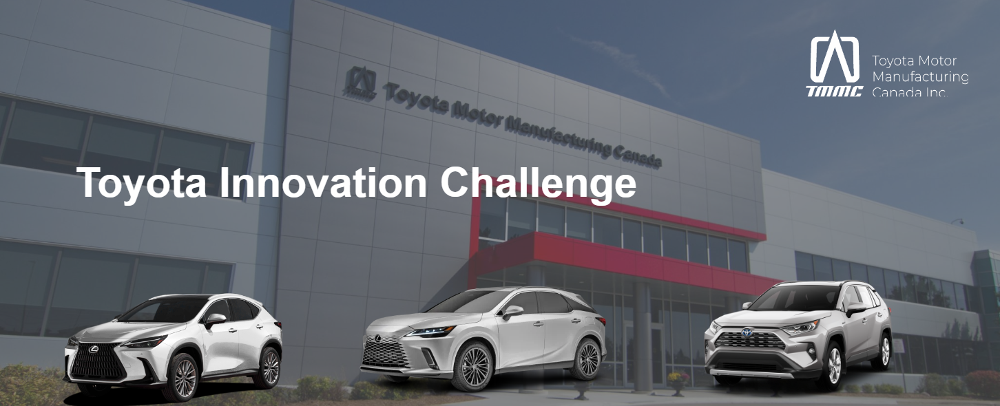
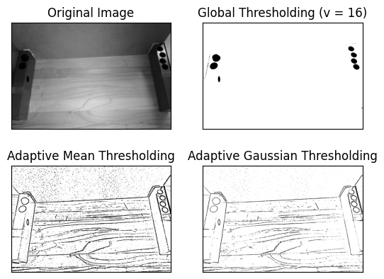
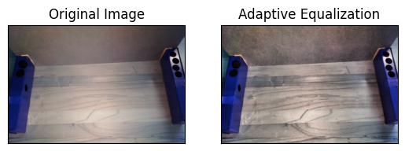
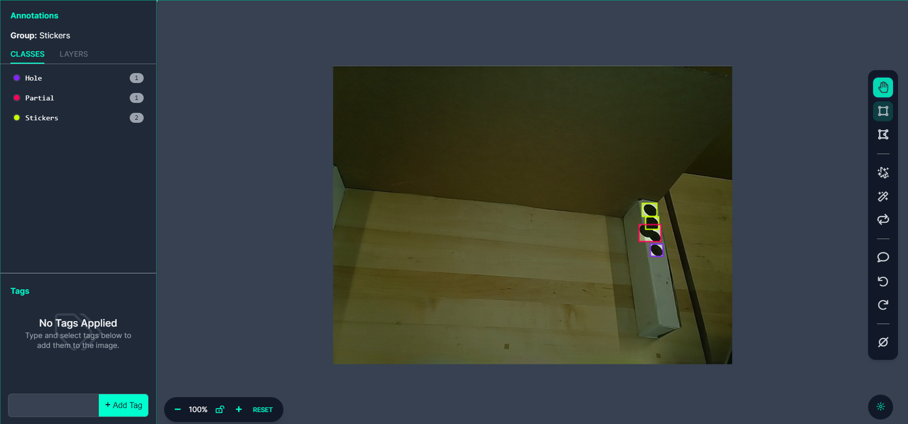
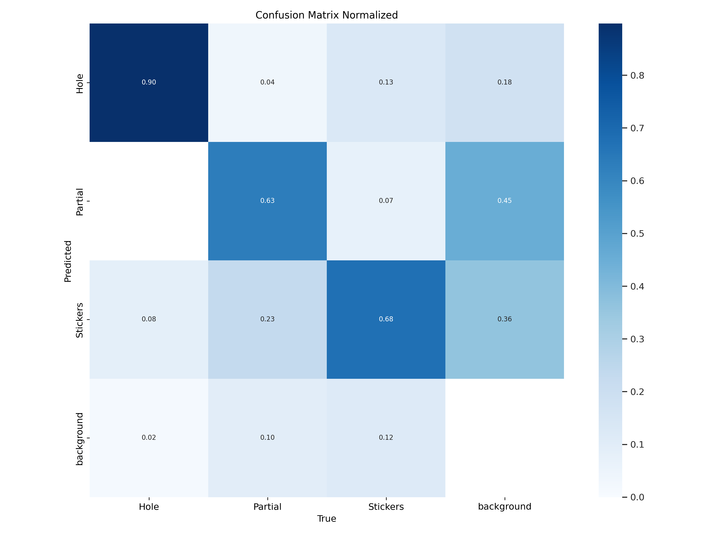
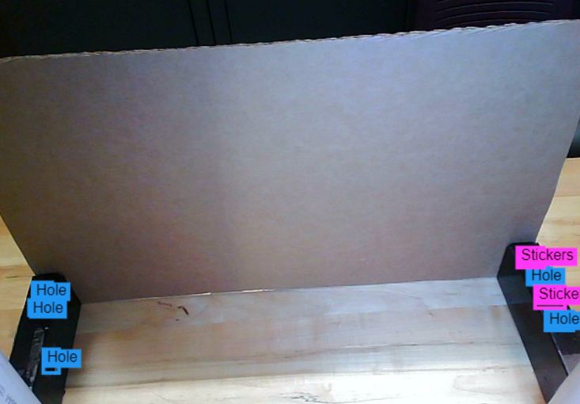

# Toyota Innovation Challenge

Team Members: Yash Jagirdar, Rohan Nair, Leo Tian, Christopher Yu

## Challenge Details

There is a need for an automated solution for installing round stickers (plug plates) on vehicle body holes. The system reduces road noise and protects against water damage. The goal of the software challenge is to develop the vision system a robot could use to automatically identify hole centers and ensures precise sticker placement.

### Example Images 📷

Images of the white and red vehicle body frames.

# Our Solution

Our solution involved image labelling and processing on [Roboflow](https://roboflow.com/) as well as transfer learning by training [Ultralytic's YOLOv8 model](https://docs.ultralytics.com/).

View our [trained model on Google Colab](https://colab.research.google.com/drive/1VLiiRDIPV27SUa_jskTNK7KiPJ_vsEvu?usp=sharing) or view the [source code](./ToyotaInnovationChallenge.ipynb).

You can also view our [presentation during the event](./Innovation_Challenge_Presentation.pptx).

## Traditional Methods Employed / Attempted

### Image Thresholding

### Adaptive Equalization

## Deep Learning

### Data Collection and Labelling

Over the challenge, we collected 150+ images and 500+ datapoints and labelled them in Roboflow. We used data augmentation to triple the amount of data samples.

### Model Training

Transfer learning was done on the Ultralytics YOLOv8 model, yielding the corresponding confusion matrix.

Here is a demonstration of our model classifying an image during our presentation.

## Achieved Outcomes
- [x] Distinguish uncovered hole from fully covered hole. Test environment: unpainted sheet metal, black sticker

- [x] Distinguish uncovered holes from fully covered holes. Can ignore vertical hole on left side. Test environment: Fixed camera, unpainted sheet metal, black sticker

- [x] Identify uncovered and partially covered holes from fully covered holes. Test environment: Fixed camera, unpainted sheet metal, black sticker

- [x] Identify uncovered and partially covered holes from fully covered holes. Must include vertical hole on left side. Test environment: moveable camera and lighting; red or white painted vehicle

## Possible Improvements

- Use a larger training dataset
    - One team had a much larger dataset (1000+ images), and had a model that was more perfomant and robust
    - However both our team and their team were acknowledged for Best Performing Model
- Customise model to include more input depth
    - Take other kinds of data like depth data
    - Be able to load both pre-processed and unprocessed data into input layer to avoid imformation loss
- Explore more classical methods of image processing in pre-processing
